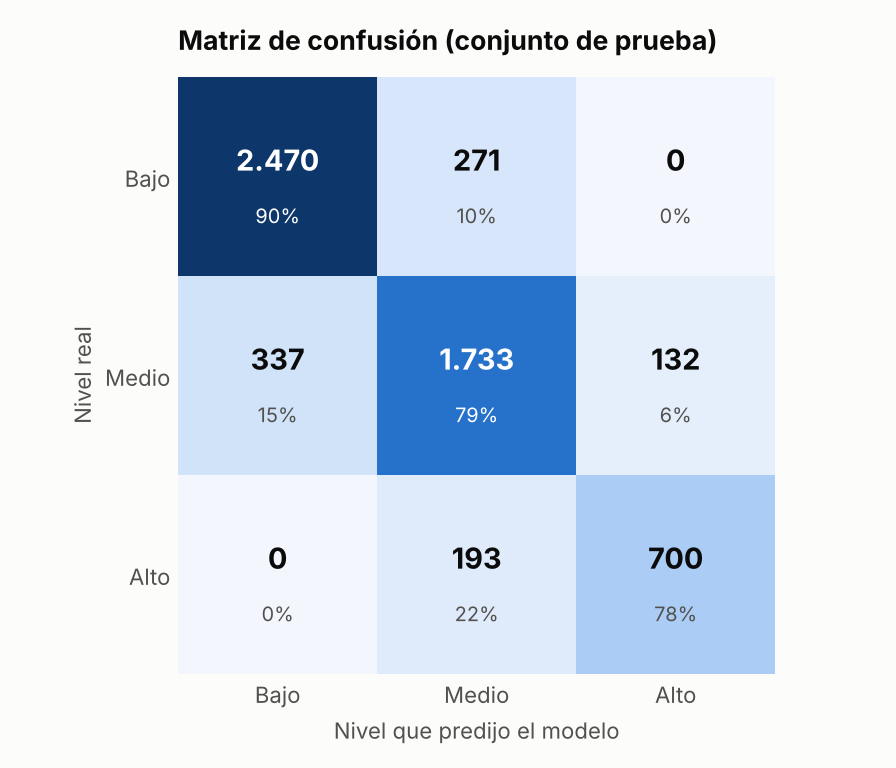
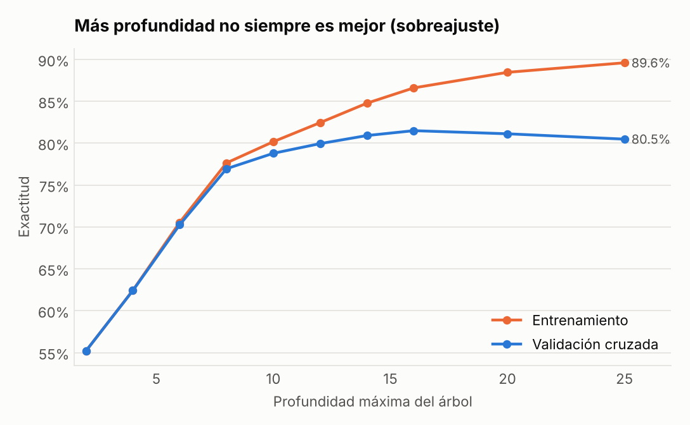
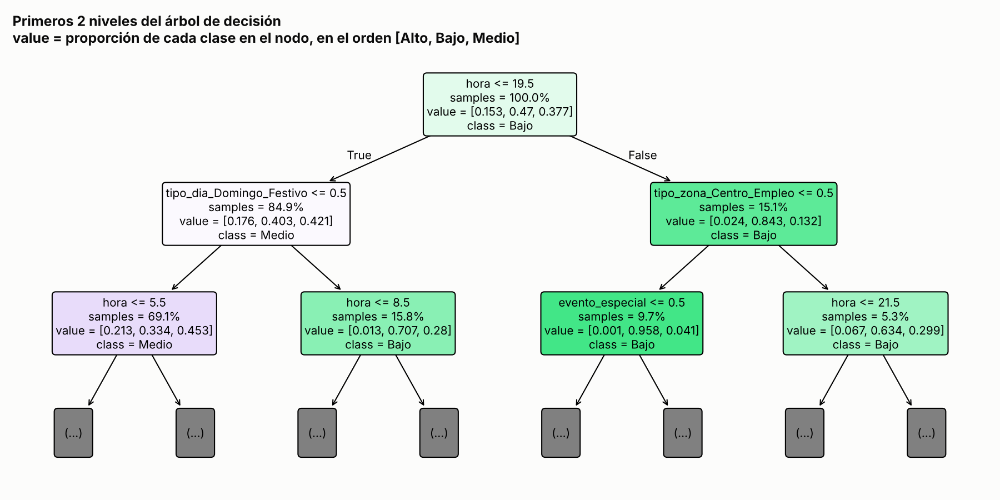
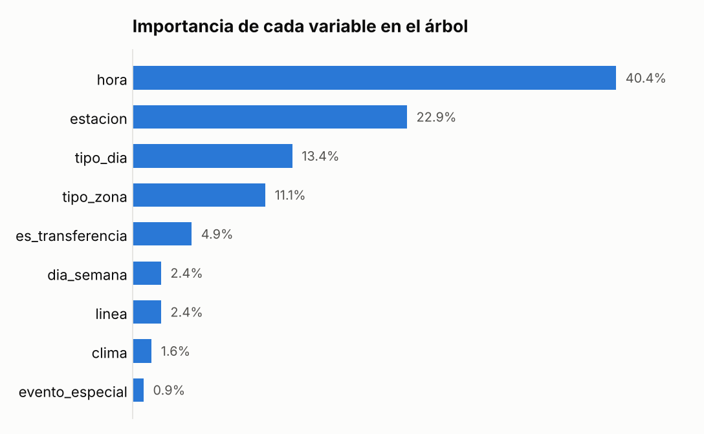

# Pruebas realizadas al modelo de predicción de congestión del Metro de Medellín

## Introducción

Este documento presenta las pruebas aplicadas al componente desarrollado en la
Actividad 5: el árbol de decisión de `src/modelo_congestion.py` y el dataset que lo
alimenta. Las pruebas se ejecutaron el 7 de octubre de 2026 en un entorno con
Python 3.13, scikit-learn 1.9, pandas 3.0 y pytest 9.1.

## Metodología

Se aplicaron tres tipos de prueba:

1. Evaluación estadística del modelo, para medir qué tan bien clasifica datos que nunca vio.
2. Pruebas automáticas con pytest (27 casos), que revisan la calidad de los datos y el comportamiento del modelo y se pueden repetir en cualquier momento.
3. Pruebas manuales de casos, mediante consultas desde la línea de comandos para comprobar que las respuestas tienen sentido.

Para repetir las pruebas se ejecutan estos comandos desde la carpeta del proyecto:

```
python src/modelo_congestion.py
python -m pytest tests -v
```

## Evaluación estadística del modelo

### Protocolo

- Se usaron 29 176 registros, divididos en 80 % para entrenamiento (23 340) y 20 % para prueba (5836). La división fue estratificada por la etiqueta y con semilla fija (42).
- Los hiperparámetros se eligieron solo con los datos de entrenamiento, mediante validación cruzada de cinco particiones. El conjunto de prueba se usó una única vez, al final.
- El árbol usa la entropía como criterio de división, es decir, la ganancia de información en la que se basan los algoritmos ID3 y C4.5 (Palma Méndez y Marín Morales, 2008). La implementación es la de scikit-learn (Pedregosa et al., 2011).

### Búsqueda de hiperparámetros

Se probaron 35 combinaciones: siete profundidades y cinco tamaños mínimos de hoja
(Tabla 1).

**Tabla 1**

*Hiperparámetros evaluados con validación cruzada*

| Hiperparámetro | Valores probados | Valor elegido |
|---|---|---|
| `max_depth` | 3, 5, 8, 10, 12, 15 y sin límite | Sin límite |
| `min_samples_leaf` | 1, 5, 10, 20 y 40 | 10 |

El árbol resultante tiene profundidad 31 y 1017 hojas. Es grande porque la estación se
codifica en 27 columnas de ceros y unos, y el árbol solo puede preguntar por una
estación a la vez. Lo que controla el sobreajuste es el tamaño mínimo de hoja: ninguna
regla puede apoyarse en menos de 10 ejemplos, lo que cumple el papel de la poda.

### Resultados en el conjunto de prueba

La Tabla 2 resume el desempeño general.

**Tabla 2**

*Desempeño general del modelo*

| Métrica | Valor |
|---|---|
| Exactitud en prueba | 84,0 % |
| Exactitud en validación cruzada | 83,7 % |
| Exactitud en entrenamiento | 85,9 % |
| F1 macro | 0,830 |
| Línea base (predecir siempre "Bajo") | 47,0 % |

El modelo acierta 37 puntos porcentuales más que la línea base, y la diferencia entre
entrenamiento y prueba es de 1,9 puntos, lo que indica que generaliza y no memorizó
los datos. La Tabla 3 muestra el desempeño por clase.

**Tabla 3**

*Desempeño por nivel de congestión en el conjunto de prueba*

| Nivel | Precisión | Exhaustividad (recall) | F1 | Casos |
|---|---|---|---|---|
| Bajo | 0,880 | 0,901 | 0,890 | 2741 |
| Medio | 0,789 | 0,787 | 0,788 | 2202 |
| Alto | 0,841 | 0,784 | 0,812 | 893 |

La matriz de confusión (Tabla 4 y Figura 1) compara el nivel real con el que predijo
el modelo.

**Tabla 4**

*Matriz de confusión del conjunto de prueba*

| Nivel real | Predijo Bajo | Predijo Medio | Predijo Alto |
|---|---|---|---|
| Bajo | 2470 | 271 | 0 |
| Medio | 337 | 1733 | 132 |
| Alto | 0 | 193 | 700 |

**Figura 1**

*Matriz de confusión del conjunto de prueba*



Ningún caso `Alto` se predijo como `Bajo`, ni al contrario. Los 933 errores ocurren
entre niveles vecinos (Bajo y Medio, o Medio y Alto), que son los menos costosos. El
punto débil es el nivel `Medio`, que está en la mitad y se confunde hacia ambos lados.

### Techo teórico de exactitud

El modelo no llega al 100 % porque los datos tienen ruido aleatorio a propósito: una
hora cuyo índice esperado es 0,79 a veces queda en 0,82 (`Alto`) y a veces en 0,76
(`Medio`), y eso no se puede predecir con las variables disponibles. Se calculó la
exactitud que tendría alguien que conociera la fórmula exacta con la que se generaron
los datos, sin el ruido: 85,4 %. El árbol alcanza 84,0 %, es decir, aprendió casi todo
lo que era posible aprender.

### Efecto de la profundidad y sobreajuste

La Tabla 5 y la Figura 2 muestran qué pasa al variar solo la profundidad máxima, con
un tamaño mínimo de hoja de 1.

**Tabla 5**

*Exactitud según la profundidad máxima del árbol*

| Profundidad | Entrenamiento | Validación cruzada |
|---|---|---|
| 2 | 55,2 % | 55,2 % |
| 4 | 62,4 % | 62,4 % |
| 6 | 70,5 % | 70,3 % |
| 8 | 77,6 % | 77,0 % |
| 10 | 80,2 % | 78,8 % |
| 12 | 82,5 % | 80,0 % |
| 14 | 84,8 % | 80,9 % |
| 16 | 86,6 % | 81,5 % |
| 20 | 88,5 % | 81,1 % |
| 25 | 89,6 % | 80,5 % |

**Figura 2**

*Exactitud en entrenamiento y en validación cruzada según la profundidad*



A partir de la profundidad 16 la exactitud de entrenamiento sigue subiendo, pero la de
validación baja: el árbol empieza a memorizar el ruido. Este es el sobreajuste que
justifica la poda de los árboles de decisión (Palma Méndez y Marín Morales, 2008). Con
un tamaño mínimo de hoja de 10, la validación sube a 83,7 %, por encima de cualquier
punto de la curva.

### Estructura del árbol e importancia de las variables

La Figura 3 muestra los dos primeros niveles del árbol. La primera pregunta es si la hora
es anterior a las 20:00. En las horas del día, la siguiente pregunta es si se trata de
un domingo o festivo; en la noche, el tipo de zona.

**Figura 3**

*Primeros dos niveles del árbol de decisión*



La Tabla 6 y la Figura 4 muestran cuánto aporta cada variable a las decisiones del árbol.

**Tabla 6**

*Importancia de las variables en el árbol*

| Variable | Importancia |
|---|---|
| `hora` | 40,4 % |
| `estacion` | 22,9 % |
| `tipo_dia` | 13,4 % |
| `tipo_zona` | 11,1 % |
| `es_transferencia` | 4,9 % |
| `dia_semana` | 2,4 % |
| `linea` | 2,4 % |
| `clima` | 1,6 % |
| `evento_especial` | 0,9 % |

**Figura 4**

*Importancia de las variables en el árbol*



La hora y la estación explican casi dos tercios de la decisión. La variable
`evento_especial` pesa poco en el total porque solo aplica al 0,5 % de los registros,
pero donde aplica cambia la predicción, como lo muestran los casos 7 y 8 de la Tabla 9.

## Pruebas automáticas

Las 27 pruebas automáticas pasaron, con un tiempo de ejecución de 18 segundos. La
Tabla 7 presenta las pruebas de calidad de los datos (`tests/test_datos.py`).

**Tabla 7**

*Pruebas de calidad de los datos*

| ID | Qué verifica | Resultado |
|---|---|---|
| D1 | El archivo tiene las 13 columnas esperadas, en orden | Aprobada |
| D2 | No hay valores nulos | Aprobada |
| D3 | No hay registros duplicados (misma fecha, hora, línea y estación) | Aprobada |
| D4 | Las horas están dentro del horario de operación (4 a 22; domingos 5 a 21) | Aprobada |
| D5 | Hay 27 estaciones (21 en la línea A y 7 en la B) y coinciden con el catálogo | Aprobada |
| D6 | Las variables categóricas solo tienen valores válidos | Aprobada |
| D7 | La etiqueta corresponde a los umbrales y el índice es pasajeros entre capacidad | Aprobada |
| D8 | Los tres festivos del periodo están marcados como Domingo_Festivo | Aprobada |
| D9 | El generador es reproducible: al ejecutarlo de nuevo produce el mismo archivo | Aprobada |

La Tabla 8 presenta las pruebas del comportamiento del modelo (`tests/test_modelo.py`).

**Tabla 8**

*Pruebas del comportamiento del modelo*

| ID | Qué verifica | Criterio | Obtenido | Resultado |
|---|---|---|---|---|
| M1 | No hay fuga de información: el modelo no usa `pasajeros_hora` ni `indice_ocupacion` | 0 columnas prohibidas | 0 | Aprobada |
| M2 | Exactitud mínima en prueba | 80 % o más | 84,0 % | Aprobada |
| M3 | Ventaja sobre la línea base | 25 puntos o más | 37,0 puntos | Aprobada |
| M4 | Sobreajuste controlado (entrenamiento menos prueba) | 5 puntos o menos | 1,9 puntos | Aprobada |
| M5 | Exhaustividad de la clase `Alto` | 70 % o más | 78,4 % | Aprobada |
| M6 | Errores graves (confundir Bajo con Alto) | Menos de 1 % | 0 % | Aprobada |
| M7 | Dos entrenamientos con los mismos datos dan las mismas predicciones | Idénticas | Idénticas | Aprobada |
| M8 | Casos de sentido común (Tabla 9) | 8 de 8 | 8 de 8 | Aprobada |
| M9 | Una estación que no existe en el entrenamiento no rompe el modelo | Clase válida | Clase válida | Aprobada |
| M10 | Las probabilidades están entre 0 y 1 y suman 1 | Siempre | Siempre | Aprobada |
| M11 | Un archivo sin las columnas necesarias se rechaza con un error claro | `ValueError` | `ValueError` | Aprobada |

La Tabla 9 detalla los casos de sentido común de la prueba M8. Los casos 2 y 3, y los
casos 7 y 8, son pares: la misma estación a la misma hora, cambiando una sola variable.
Sirven para comprobar que el árbol aprendió el efecto del festivo y del evento.

**Tabla 9**

*Casos de sentido común evaluados en la prueba M8*

| Caso | Estación | Día y hora | Condición | Esperado | Predicho |
|---|---|---|---|---|---|
| 1 | San Antonio (A) | Viernes 18:00 | Ninguna | Alto | Alto |
| 2 | Niquía | Lunes 6:00 | Ninguna | Alto | Alto |
| 3 | Niquía | Lunes 6:00 | Festivo | Bajo | Bajo |
| 4 | La Estrella | Domingo 6:00 | Lluvia | Bajo | Bajo |
| 5 | Poblado | Martes 22:00 | Ninguna | Bajo | Bajo |
| 6 | Madera | Martes 7:00 | Ninguna | Medio | Medio |
| 7 | Estadio | Sábado 19:00 | Sin partido | Bajo | Bajo |
| 8 | Estadio | Sábado 19:00 | Con partido | Alto | Alto |

## Pruebas manuales

Se hicieron consultas desde la línea de comandos con `src/predecir.py`. Las tres
primeras comprueban predicciones normales; las dos últimas, entradas inválidas que el
programa rechaza con un mensaje comprensible en lugar de fallar.

```
> python src/predecir.py --estacion "San Antonio" --dia Viernes --hora 18
Nivel de congestión esperado: ALTO

> python src/predecir.py --estacion Suramericana --dia Miércoles --hora 18
Nivel de congestión esperado: MEDIO

> python src/predecir.py --estacion Suramericana --dia Miércoles --hora 18 --evento
Nivel de congestión esperado: ALTO

> python src/predecir.py --estacion Chapinero --dia Martes --hora 7
Estación no encontrada: 'Chapinero'.

> python src/predecir.py --estacion Poblado --dia Martes --hora 3
La hora debe estar entre 4 y 22 (horario de operación).
```

## Hallazgo durante las pruebas

En la primera versión del dataset solo había seis fechas de partido, es decir, 60
registros con evento (0,2 % del total). Al probar el caso 8, el modelo respondió `Bajo`
con partido y sin partido: no había aprendido el efecto del evento, y la importancia de
esa variable era de 0,1 %. Con tan pocos ejemplos, y con un mínimo de 10 por hoja, el
árbol no tenía de dónde sacar esa regla.

El problema se corrigió ampliando la muestra a 15 fechas de partido (150 registros),
lo que además es más realista para un estadio con dos equipos locales. Después del
cambio el caso 8 se aprueba y la exactitud general se mantuvo (pasó de 83,8 % a
84,0 %). La lección es que una exactitud global alta puede ocultar fallas en los casos
poco frecuentes, que a veces son justamente los que más interesa predecir. Por eso los
casos 7 y 8 quedaron como prueba automática.

## Limitaciones

- Las pruebas miden qué tan bien el árbol recupera patrones de datos simulados. No demuestran que vaya a alcanzar 84 % con datos reales del Metro.
- La división entre entrenamiento y prueba es aleatoria. Con datos reales convendría probar también una división por fechas: entrenar con semanas pasadas y evaluar con semanas posteriores.
- El efecto de la lluvia es pequeño (12 %) y el árbol casi no lo usa (1,6 % de importancia); solo cambia la predicción en casos cercanos a un umbral.
- Con otras versiones de scikit-learn los resultados pueden variar en décimas.

## Referencias

Palma Méndez, J. T., y Marín Morales, R. L. (Coords.). (2008). *Inteligencia artificial: Métodos, técnicas y aplicaciones*. McGraw-Hill.

Pedregosa, F., Varoquaux, G., Gramfort, A., Michel, V., Thirion, B., Grisel, O., Blondel, M., Prettenhofer, P., Weiss, R., Dubourg, V., Vanderplas, J., Passos, A., Cournapeau, D., Brucher, M., Perrot, M., y Duchesnay, É. (2011). Scikit-learn: Machine learning in Python. *Journal of Machine Learning Research, 12*, 2825–2830.
