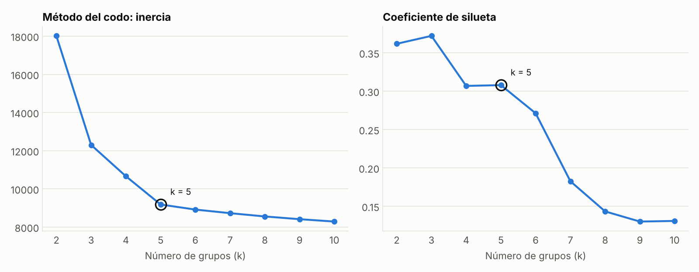
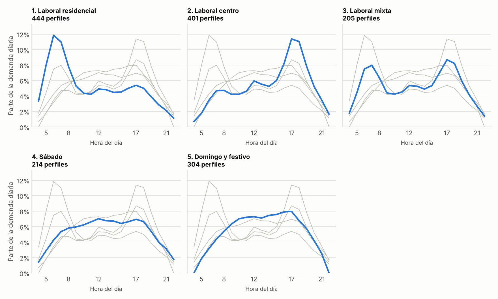
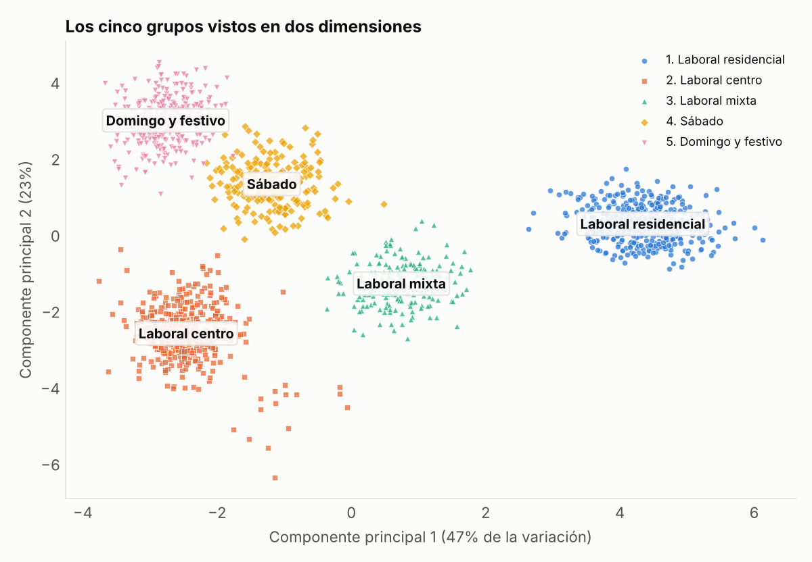
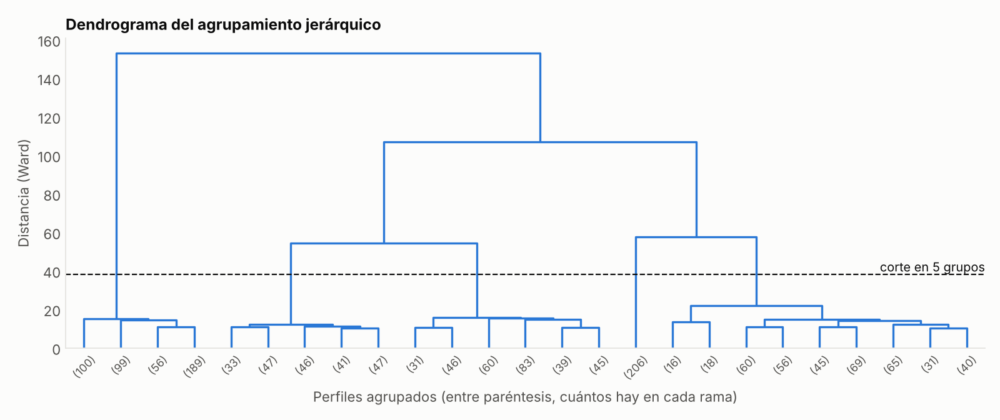

# Pruebas realizadas al modelo de agrupamiento de patrones de demanda del Metro de Medellín

## Introducción

Este documento presenta las pruebas aplicadas al componente desarrollado en la
Actividad 4: el agrupamiento de `src/agrupamiento.py` y los perfiles de demanda que lo
alimentan. Las pruebas se ejecutaron el 9 de octubre de 2026 en un entorno con
Python 3.13, scikit-learn 1.9, SciPy 1.18 y pytest 9.1.

Probar un modelo no supervisado es distinto de probar uno supervisado, porque no
existe una respuesta correcta con la cual comparar cada caso. Por eso se combinaron
medidas internas, que evalúan qué tan compactos y separados están los grupos, con
medidas externas, que comparan los grupos con información que el algoritmo no recibió
(Hastie et al., 2009).

## Metodología

Se aplicaron tres tipos de prueba:

1. Evaluación del agrupamiento: elección del número de grupos con el método del codo y el coeficiente de silueta, comparación entre k-means y el método jerárquico de Ward, y validación contra el tipo de día y de zona.
2. Pruebas automáticas con pytest (17 casos), que revisan la calidad de los perfiles y el comportamiento del agrupamiento.
3. Pruebas manuales de consulta desde la línea de comandos.

Para repetirlas se ejecutan estos comandos desde la carpeta del proyecto:

```
python src/agrupamiento.py
python -m pytest tests -v
```

## Evaluación del agrupamiento

### Elección del número de grupos

K-means necesita que se le indique cuántos grupos buscar. Se probaron valores de k
entre 2 y 10 y, para cada uno, se midieron la inercia (la suma de distancias de cada
perfil al centro de su grupo) y el coeficiente de silueta (Tabla 1 y Figura 1).

**Tabla 1**

*Inercia y coeficiente de silueta según el número de grupos*

| k | Inercia | Silueta |
|---|---|---|
| 2 | 18 013,7 | 0,362 |
| 3 | 12 300,9 | 0,372 |
| 4 | 10 662,8 | 0,307 |
| 5 | 9181,7 | 0,308 |
| 6 | 8915,5 | 0,271 |
| 7 | 8727,7 | 0,183 |
| 8 | 8555,6 | 0,143 |
| 9 | 8412,6 | 0,130 |
| 10 | 8288,6 | 0,131 |

**Figura 1**

*Método del codo y coeficiente de silueta*



La inercia siempre baja al aumentar k, pero deja de bajar de forma importante a partir
de k = 5: de 4 a 5 grupos cae 1481 unidades y de 5 a 6 solo 266. Ese quiebre es el
"codo" de la curva (Thorndike, 1953). Para no elegirlo a ojo, el programa lo detecta
como el punto más alejado de la recta que une el primer y el último valor, y el
resultado es k = 5.

La silueta más alta está en k = 3. Con tres grupos el algoritmo separa solo días
laborales residenciales, días laborales de centro y fines de semana, una división
correcta pero gruesa. Se eligió k = 5 porque coincide con el codo, mantiene una silueta
casi igual a la de k = 4 y produce grupos con significado operativo distinto. Una
silueta de 0,31 indica una estructura de grupos razonable (Rousseeuw, 1987).

### Grupos encontrados

La Tabla 2 describe los cinco grupos. El nombre de cada grupo se asignó después de
agrupar, mirando qué tipo de día y de zona predomina en él.

**Tabla 2**

*Grupos encontrados por k-means*

| Grupo | Nombre | Perfiles | Porcentaje | Hora pico | Estaciones |
|---|---|---|---|---|---|
| 1 | Laboral residencial | 444 | 28,3 % | 6:00 | 12 |
| 2 | Laboral centro | 401 | 25,6 % | 17:00 | 11 |
| 3 | Laboral mixta | 205 | 13,1 % | 17:00 | 6 |
| 4 | Sábado | 214 | 13,6 % | 12:00 | 27 |
| 5 | Domingo y festivo | 304 | 19,4 % | 17:00 | 27 |

La Figura 2 muestra el perfil medio de cada grupo. El grupo 1 concentra el 12 % de su
demanda diaria a las 6:00, cuando la gente sale de los barrios hacia el trabajo; el
grupo 2 tiene su pico a las 17:00, cuando regresa; el grupo 3 tiene dos picos
moderados; y los grupos 4 y 5 reparten la demanda a lo largo del día.

**Figura 2**

*Perfil horario medio de cada grupo*



La Figura 3 proyecta los 1568 perfiles en dos dimensiones mediante análisis de
componentes principales, que en conjunto conservan el 69 % de la variación. Los cinco
grupos aparecen como nubes separadas.

**Figura 3**

*Los grupos proyectados en dos dimensiones*



### Comparación con el método jerárquico

Para comprobar que los grupos no dependen del algoritmo, se repitió el agrupamiento con
el método jerárquico aglomerativo de Ward (1963), que parte de cada perfil como un grupo
y los va uniendo de a dos. La Figura 4 muestra el dendrograma y el corte en cinco
grupos. La coincidencia entre ambos métodos, medida con el índice de Rand ajustado
(Hubert y Arabie, 1985), es de 0,999, prácticamente total.

**Figura 4**

*Dendrograma del agrupamiento jerárquico de Ward*



### Validación con información externa

El tipo de día y el tipo de zona no se le entregaron al algoritmo, así que sirven para
verificar si los grupos tienen sentido. La Tabla 3 cruza los grupos con esas variables.

**Tabla 3**

*Grupos frente al tipo de día y de zona*

| Tipo de día y zona | Grupo 1 | Grupo 2 | Grupo 3 | Grupo 4 | Grupo 5 |
|---|---|---|---|---|---|
| Laboral, residencial | 444 | 0 | 0 | 0 | 0 |
| Laboral, centro y empleo | 0 | 370 | 0 | 0 | 0 |
| Laboral, mixta | 0 | 17 | 205 | 0 | 0 |
| Sábado, residencial | 0 | 0 | 0 | 96 | 0 |
| Sábado, centro y empleo | 0 | 0 | 0 | 80 | 0 |
| Sábado, mixta | 0 | 10 | 0 | 38 | 0 |
| Domingo o festivo, residencial | 0 | 0 | 0 | 0 | 132 |
| Domingo o festivo, centro y empleo | 0 | 0 | 0 | 0 | 110 |
| Domingo o festivo, mixta | 0 | 4 | 0 | 0 | 62 |

El índice de Rand ajustado entre los grupos y esta clasificación es de 0,955. Las únicas
diferencias son 31 perfiles de zonas mixtas que el algoritmo puso en el grupo de centro.
Al revisarlos, 30 son de las estaciones Estadio y Suramericana en días de partido: con
el evento, esas estaciones reciben una avalancha de gente en la tarde y su patrón se
vuelve igual al de una estación del centro. El algoritmo descubrió ese efecto sin que
nadie le dijera que había partidos.

## Pruebas automáticas

Las 17 pruebas automáticas se aprobaron, con un tiempo de ejecución de 3 segundos. La
Tabla 4 presenta las pruebas de los perfiles (`tests/test_datos.py`).

**Tabla 4**

*Pruebas de calidad de los perfiles*

| ID | Qué verifica | Resultado |
|---|---|---|
| D1 | Hay exactamente un perfil por estación, línea y día (1568) | Aprobada |
| D2 | Cada perfil tiene las 19 horas de 4:00 a 22:00 | Aprobada |
| D3 | No hay valores nulos | Aprobada |
| D4 | Cada perfil suma 1 y no tiene valores negativos | Aprobada |
| D5 | El total de pasajeros de los perfiles coincide con el del archivo de afluencia | Aprobada |
| D6 | Los domingos y festivos no tienen ingresos a las 4:00 ni a las 22:00 | Aprobada |

La Tabla 5 presenta las pruebas del agrupamiento (`tests/test_modelo.py`).

**Tabla 5**

*Pruebas del comportamiento del agrupamiento*

| ID | Qué verifica | Criterio | Obtenido | Resultado |
|---|---|---|---|---|
| M1 | El método del codo elige cinco grupos | k = 5 | k = 5 | Aprobada |
| M2 | Separación aceptable entre grupos | Silueta mayor que 0,25 | 0,308 | Aprobada |
| M3 | Ningún grupo vacío ni diminuto | Cada grupo con más del 5 % | Mínimo 13,1 % | Aprobada |
| M4 | K-means y Ward coinciden | ARI mayor que 0,90 | 0,999 | Aprobada |
| M5 | Los grupos recuperan el tipo de día y de zona | ARI mayor que 0,85 | 0,955 | Aprobada |
| M6 | Ningún grupo mezcla días laborales con fines de semana | Pureza mayor que 90 % | Cumple | Aprobada |
| M7 | Dos ejecuciones dan los mismos grupos | ARI igual a 1 | 1 | Aprobada |
| M8 | Los días de partido quedan con el patrón de centro | Más del 90 % | 100 % | Aprobada |
| M9 | Un perfil nuevo con pico a las 6:00 va al grupo residencial, y el mismo invertido, al de centro | 2 de 2 | 2 de 2 | Aprobada |
| M10 | Un archivo sin las columnas necesarias se rechaza con un error claro | `ValueError` | `ValueError` | Aprobada |

## Pruebas manuales

Se hicieron consultas desde la línea de comandos con `src/consultar.py`. La última
comprueba que el programa rechaza una estación que no existe con un mensaje comprensible.

```
> python src/consultar.py --estacion "San Antonio"
Estación San Antonio: 112 días analizados
  Laboral centro        74 días (66%)
  Domingo y festivo     22 días (20%)
  Sábado                16 días (14%)

> python src/consultar.py --estacion Estadio --dia Sábado
Estación Estadio · Sábado: 8 días analizados
  Laboral centro         5 días (62%)
  Sábado                 3 días (38%)
  (de esos días, 5 tuvieron partido en el estadio y quedaron en: Laboral centro)

> python src/consultar.py --estacion Chapinero
Estación no encontrada: 'Chapinero'.
```

La segunda consulta muestra el hallazgo de la Tabla 3 en un caso concreto: los sábados
sin partido la estación Estadio se comporta como un sábado normal, y los sábados con
partido, como una estación del centro.

## Limitaciones

- Los perfiles provienen de datos simulados a partir de tipos de zona y de día, así que era esperable que el algoritmo los recuperara. Con datos reales los grupos serían menos nítidos.
- K-means supone grupos de forma aproximadamente esférica y de tamaño parecido; con datos reales convendría probar también métodos basados en densidad.
- El número de grupos se eligió con el codo; la silueta sugiere tres, de modo que la elección final combina las medidas con la interpretación.

## Referencias

Hastie, T., Tibshirani, R., y Friedman, J. (2009). *The elements of statistical learning: Data mining, inference, and prediction* (2.ª ed.). Springer. https://doi.org/10.1007/978-0-387-84858-7

Hubert, L., y Arabie, P. (1985). Comparing partitions. *Journal of Classification, 2*(1), 193–218. https://doi.org/10.1007/BF01908075

Rousseeuw, P. J. (1987). Silhouettes: A graphical aid to the interpretation and validation of cluster analysis. *Journal of Computational and Applied Mathematics, 20*, 53–65. https://doi.org/10.1016/0377-0427(87)90125-7

Thorndike, R. L. (1953). Who belongs in the family? *Psychometrika, 18*(4), 267–276. https://doi.org/10.1007/BF02289263

Ward, J. H., Jr. (1963). Hierarchical grouping to optimize an objective function. *Journal of the American Statistical Association, 58*(301), 236–244. https://doi.org/10.1080/01621459.1963.10500845
